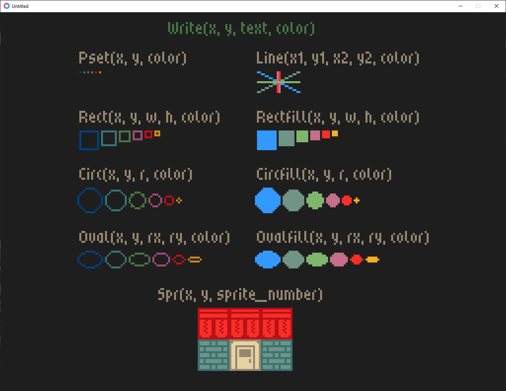

### About

This project is a work-in-progress game creation kit. Heavily inspired by fantasy consoles like PICO-8 and TIC-80. This project aims to provide all the tools usually found in fantasy consoles, such as sprite editor, map editor, sound editor, and API, without imposing harsh limitations on user such as code tokens limit.

Under the hood, it's wrapper around Love2D.

### Goals

- provide all the basic tools to create simple games
- create API that will feel familiar to people who know PICO-8
- make sure that the kit is extensible (e.g. can be used with third-party libraries)
- keep the magic of fantasy consoles by providing *some* arbitrary limitations

### Non-goals

- become PICO-8 compatible,
- implement full-fledged fantasy console (ergo: no hardware specs, no VM emulation, etc.),
- implement severe limitations that would force small scale of games.

### Prerequisites

- Love2D
- LuaUnit (for unit tests)
- json.lua library by rxi
- bresenham library by Petr Viktorin
- "Pixuf" font by erytau

Each release is shipped with all of these dependencies included in the archive (with single exception: Love2D is not included in the linux_small archive).

For licensing details, please see the `LicenseNotice.txt` file and license files inside the `licenses` directory.

### How to start

- use the `_cart.lua` to program your app
- start the app, either by:
	- drag-and-drop `fantasy_console` directory on you Love2D installation, or
	- by executing `start.bat` file (this assumes that `fantasy_console` and `love` directory are in the same root directory)

- to test specific test file, run `lua5.1 foo_test.lua -v`; you might also specify output format, e.g. `-o TAP` for TAP format.

### Documentation

To learn more about this project, please read the `about.txt` file.  
To check the currently implemented API, please read the `api_reference.txt` file.
To get an idea of ​​the API completeness and compare the capabilities of this project with PICO-8, you might want to check `pico-8-api.md` file.

### Roadmap

- [x] text manipulation
- [x] geometry
* [x] sprites
- [ ] animations
- [ ] sounds
* [x] sprite editor
- [ ] sound editor
- [ ] support for various languages

### Screenshots

